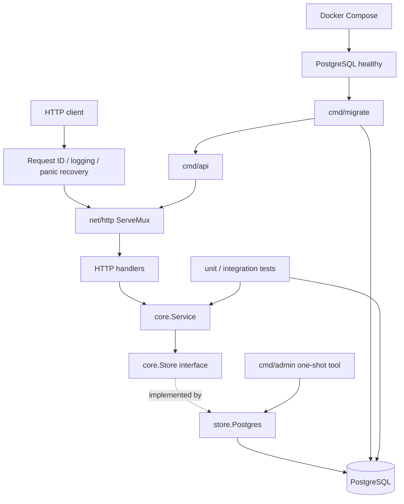

# 活動報名 API：Top-down Code Review 架構總覽

這組文件以「先看系統如何啟動與接收請求，再逐層追到業務規則和資料持久化」的順序閱讀。它是程式碼導覽與 review 輔助資料；實際行為仍以連結的程式碼、SQL 和 Compose 設定為準。

## 系統地圖



API 的依賴組裝發生在 [`cmd/api/main.go`](../../cmd/api/main.go)：建立 `*sql.DB` 連線池、`store.Postgres`、`core.Service`，再交給 `httpapi.NewServer`。`core.Service` 只依賴自己宣告的 `core.Store` 介面，PostgreSQL adapter 實作這個介面。

## 各部分 Code Review

依序由執行入口往下閱讀；每份文件聚焦一個程式入口、package 或專案設定部分。

1. [`cmd/api`](01-cmd-api-code-review.md)：API 程序入口、依賴組裝、HTTP server 生命週期。
2. [`cmd/migrate`](02-cmd-migrate-code-review.md)：資料庫連線、嵌入 migration、Goose 升級流程。
3. [`cmd/admin`](03-cmd-admin-code-review.md)：管理員輸入驗證、密碼雜湊與 upsert 行為。
4. [`internal/httpapi`](04-httpapi-code-review.md)：路由、DTO、middleware、身份驗證和錯誤回應。
5. [`internal/core`](05-core-code-review.md)：業務模型、Store 介面、驗證與授權。
6. [`internal/store`](06-store-code-review.md)：PostgreSQL SQL、錯誤映射和交易併發。
7. [`internal/migrations`](07-migrations-code-review.md)：Migration embed package 與初始 schema SQL。
8. [測試程式碼](08-tests-code-review.md)：Core 單元測試與 HTTP/PostgreSQL 整合測試。
9. [Dockerfile 與 Compose](09-docker-compose-code-review.md)：映像建置、服務依賴、健康檢查與測試資料庫。
10. [OpenAPI 規格](10-openapi-code-review.md)：對外 API 契約與 handler 實作的對照方式。

## 一個請求如何走完整條鏈

以會員報名為例：

```text
POST /v1/events/{id}/registrations
  → ServeMux 選擇 registerForEvent
  → currentUser 從 Bearer token 查 session
  → core.Service.Register 傳入使用者 ID 與活動 ID
  → Store.Register 開始 SQL transaction
  → 條件式扣除一個名額，再新增報名紀錄
  → commit 成功後回傳 201；失敗則轉成一致的 API error
```

HTTP handler 負責協定細節，`core.Service` 負責輸入規則與角色權限，`store.Postgres` 負責 SQL、交易以及資料庫錯誤轉譯。名額是否還有剩餘屬於會受併發影響的資料狀態，所以最終判斷必須在資料庫交易中完成，不能只靠 handler 先讀 `remaining` 再寫入。

## 核心資料不變條件

- 密碼原文不寫入資料庫；session 原始 token 只回給登入者，資料庫保存 token hash。
- 一個活動的 `remaining` 必須介於 `0` 與 `capacity` 之間。
- 同一使用者同一活動同時最多有一筆未取消的報名。
- 報名扣名額與新增報名紀錄屬於同一交易；取消標記與釋出名額也屬於同一交易。
- 只有 admin 可以建立、更新、關閉活動，或查看活動的報名名單。

這些條件分別由 Go 業務檢查、SQL transaction、unique/check constraints 維護；各自的責任位置在後續文件中追蹤。

## 如何使用這組 review

每份文件都包含程式入口、主要資料流、實作取捨和 review 時可追問的問題。閱讀時可以沿著檔案連結打開原始碼，再沿呼叫鏈往下一層走。若發現規格與實作不一致，優先比對 `openapi.yaml`、handler、service、SQL 以及實際測試；不要只把 README 當成行為的唯一依據。
