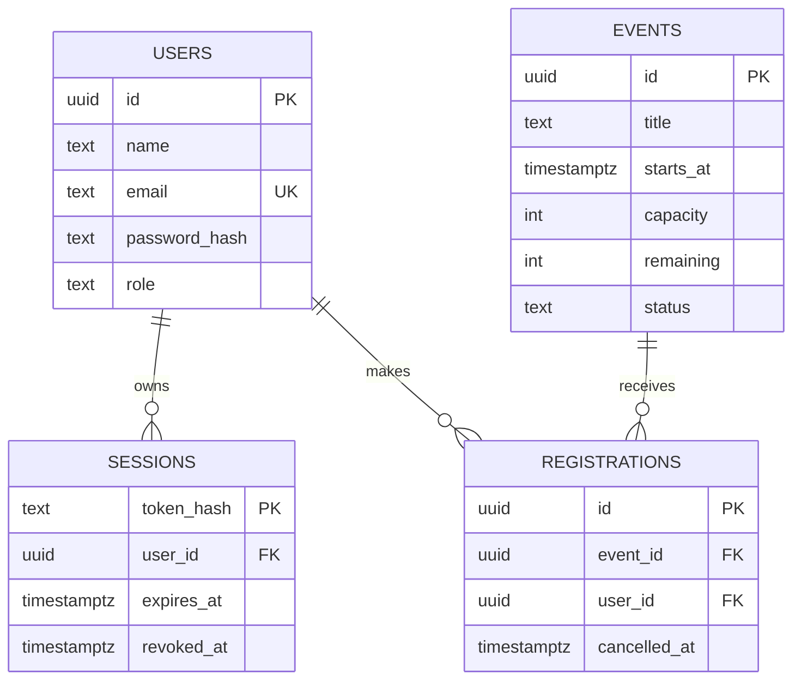

# 05. 資料模型與 Migration

[← 回到架構總覽](00-架構總覽.md)

目前資料庫 schema 由 [`internal/migrations/00001_create_schema.sql`](../../internal/migrations/00001_create_schema.sql) 建立，並透過 [`internal/migrations/embed.go`](../../internal/migrations/embed.go) 編進 binary。migration 執行入口在 [`cmd/migrate/main.go`](../../cmd/migrate/main.go)，由 Goose 記錄已套用版本。

## 關聯模型

`users` 保存會員和 admin；`sessions` 保存 token hash、到期時間與撤銷時間；`events` 保存活動與剩餘容量；`registrations` 保留報名歷程，以 `cancelled_at` 表示取消，而不是刪除原紀錄。

## 資料庫約束

- `users.email` unique；`role` 限定為 `member` 或 `admin`；名稱長度及 email 長度有 check constraint。
- `events.capacity > 0`，且 `remaining BETWEEN 0 AND capacity`；狀態限定 `open` 或 `closed`。
- `registrations` 以外鍵指向活動和使用者。
- partial unique index `registrations_one_active_idx` 只涵蓋 `cancelled_at IS NULL` 的資料，讓同一使用者取消後可重新報名，同時避免兩筆有效報名。
- sessions、events 和 registrations 有依常見查詢條件建立的索引。

PostgreSQL check constraint 可以保證 `remaining` 不會小於零或大於 capacity，但它不能單靠 row check 保證 `remaining` 等於 `capacity - 有效報名筆數`。這個跨多 row 的不變條件由 Store 在交易中維護，整合測試會讀資料庫檢查結果。

## Migration review

新 schema 變更應新增 Goose migration，不要直接改已經套用到他人資料庫的舊 migration。向前遷移要考慮舊資料和 lock 時間；Down 段要依外鍵依賴的反方向 drop。此專案目前只有初始 migration，因此尚未呈現多版本升級、資料轉換與 rollback 實務。

review migration 時逐項檢查：欄位 nullability/default、check/unique/foreign key、索引查詢方向、資料轉換是否可重跑、Down 是否會丟資料，以及新舊 API binary 是否能與遷移後 schema 共存。

## Review 時追問

- 是否應對 email 加入大小寫不敏感的資料庫唯一索引？目前應用程式會先轉小寫，但直接 SQL 寫入不受這個正規化保護。
- 刪除使用者或活動時，報名歷史應保留還是 cascade？目前 registrations 的外鍵採預設限制刪除。
- 是否需要唯一限制或狀態欄位以支援活動取消、軟刪除或報名截止時間？目前只有 open/closed 和 starts_at。
- 若要避免 `remaining` 漂移，是否改成由 active registrations 即時計算，或保留快取欄位並加入 reconciliation job？這是讀取效能與一致性複雜度的取捨。
